# Ansible-Practice
# Ansible: 
* It is an open-source automation tool, or platform, used for IT tasks such as configuration management, application deployment, intraservice orchestration, and provisioning.
* Ansible is a tool written in Python, and it uses the declarative markup language YAML to describe the desired state of devices and configuration. In association with the idea of a "desired state," Ansible also uses the concept of idempotency.
* function of Ansible roles allow you to develop reusable automation components by grouping and encapsulating related automation artifacts, like configuration files, templates, tasks, and handlers. 
# What is a node in Ansible?
* Ansible control nodes are primarily used to run tasks on managed hosts. You can use any machine with Python installed as an Ansible control node. However, you cannot use Windows as an Ansible control node. Managed nodes: Hosts that you manage using Ansible. 
* Inventory: A list of managed nodes.
# Configuration Management (CM)
* Ansible is a configuration management platform that automates storage, servers, and networking. When you use Ansible to configure these components, difficult manual tasks become repeatable and less vulnerable to error.
* There are two types of CM
* **Pull based CM:** In this type of configuration management tool, the nodes pull the configuration information from the server (hence, the name).A small software (called agent or client) is installed on every node.
* This agent/client will:at regular intervals, get the configuration from the server compare the configuration received from the server with the current configuration of the node, if there is any mis-match, take the steps required to match the configuration of the node with the configuration received from the server.
* Chef & Puppet are good examples of such configuration management tools.
* **Push Based CM:** In this type of configuration management tool, the main server (where the configuration data is stored) pushes the configuration to the node (hence, the name). So, it is the main server that initiates communication, not the nodes. Which means that an agent/client may or may not be installed on each node.
* Ansible & SaltStack are good examples of such configuration management tools.
# Architecture of Ansible
* Ansible works by connecting to your nodes and pushing out scripts called “Ansible modules” to them. Most modules accept parameters that describe the desired state of the system. Ansible then executes these modules (over SSH by default), and removes them when finished. Your library of modules can reside on any machine, and there are no servers, daemons, or databases required.
* Basic workflow
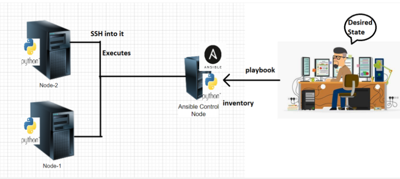
* Ansible control node can execute desired state on nodes using
    * adhoc commands
    * playbooks
* Playbooks are YAML files.
# How Operations Team work on multiple servers
* Organizations will have lot of servers and lot of admins
* Creating individual logins on each server for every admin is not a feasible solution.
* An effective way is organization creates a service account for the admins to login and perform administration.
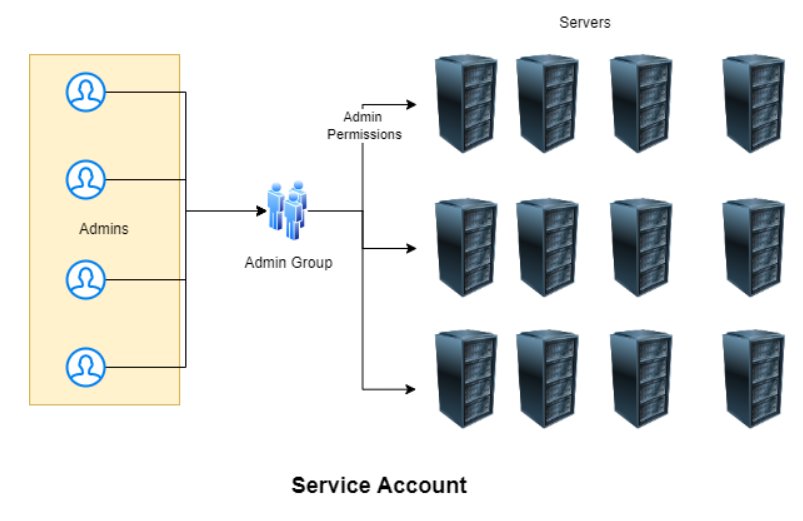
# Installation of Ansible
* Create two virtual machines(EC2 instances) and login to machines by ssh into.
* One is control node and node.
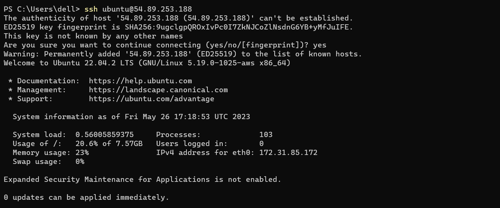
* Then create a user in both machines and give sudo permissions for users by adding into sudoers file, switch as a user.
* Enable password based authontication no to yes in `/etc/ssh/sshd/sshd_config` and restart the service `sshd`

* Generate Public and Private keys by `ssh-keygen`
* connect to the machine using private key ssh -i <path-to-private key> username@ipaddress
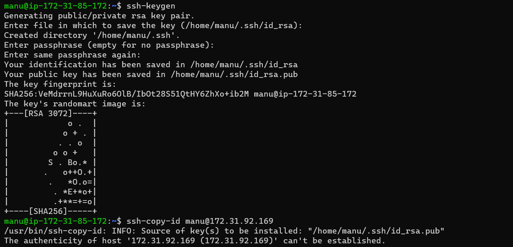
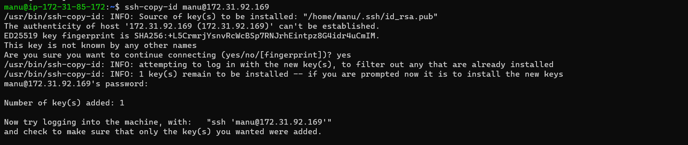
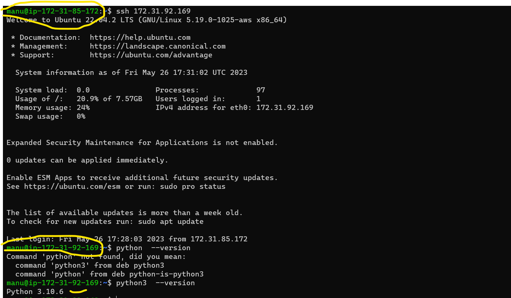
* Install Ansible by using below commands
```
sudo apt update
sudo apt install software-properties-common -y
sudo add-apt-repository --yes --update ppa:ansible/ansible
sudo apt install ansible -y
```
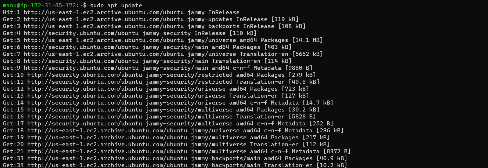
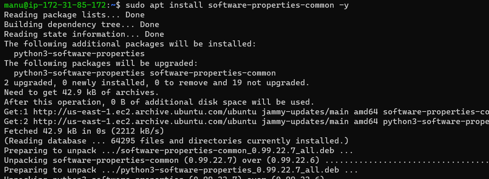
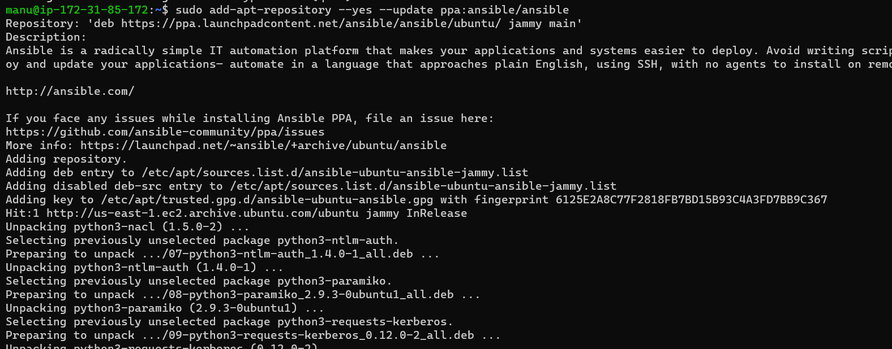
* Verify ansible versions of ansible `ansible --version` and python `python3 --version`
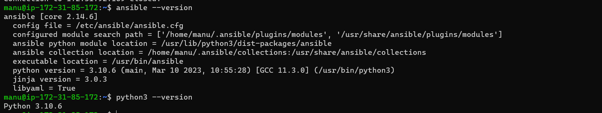
* Lets add a Inventory, file called as hosts and add <ip address > of node.
* Check connectivity by executing `ansible -i hosts -m ping all`


## TASKS GIVEN IN CLASS
* Write a Playbook to install apache2 and nginx server with Php
```yaml
## To install apache server with php
---
- name: install apache2 server
  hosts: all
  become: yes
  tasks:
    - name: install apache2
      ansible.builtin.apt:
        name: apache2
        update_cache: yes
        state: present
    - name: install php
      ansible.builtin.apt:
        name: 
          - php
          - libapache2-mod-php
          - php-mysql
        update_cache: yes
        state: present
    - name: Copy info.php to php path
      ansible.builtin.copy:
        src: info.php
        dest: /var/www/html/info.php
```
* Create a playbook with above yaml file 
* Run the following commands to verfify & run playbook
`ansible-playbook -i invetory/hosts --syntax-check php.yaml`
`ansible-playbook -i invetory/hosts --check php.yaml`
`ansible-playbook -i invetory/hosts php.yaml`
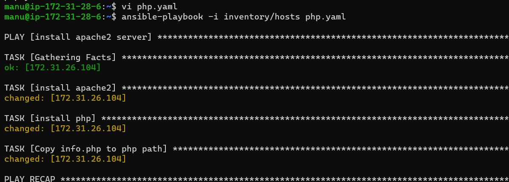
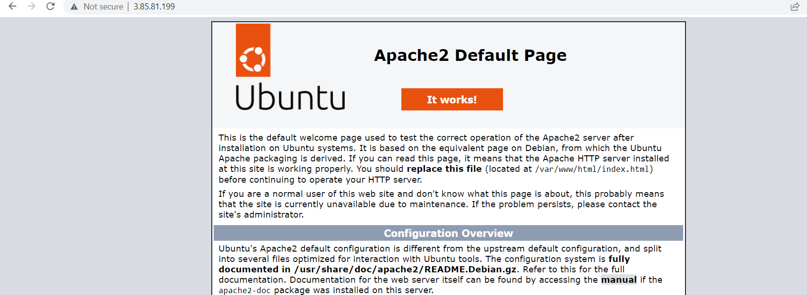
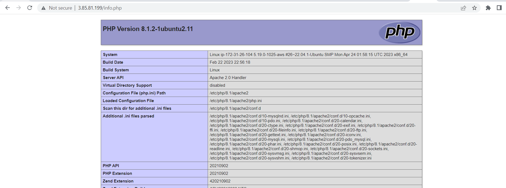
```yaml
---
## To install nginx server with php
- name: install nginx
  hosts: all
  become: yes
  tasks:
    - name: install nginx
      ansible.builtin.apt:
        name: nginx
        update_cache: yes
        state: present
    - name: install php
      ansible.builtin.apt:
        name: 
          - php
          - libapache2-mod-php
          - php-mysql
        update_cache: yes
        state: present
    - name: Copy info.php to php path
      ansible.builtin.copy:
        src: info.php
        dest: /var/www/html/info.php
```
* Create a playbook with above yaml file 
* Run the following commands to verfify & run playbook
`ansible-playbook -i invetory/hosts --syntax-check nginx-php.yaml`
`ansible-playbook -i invetory/hosts --check nginx-php.yaml`
`ansible-playbook -i invetory/hosts nginx-php.yaml`
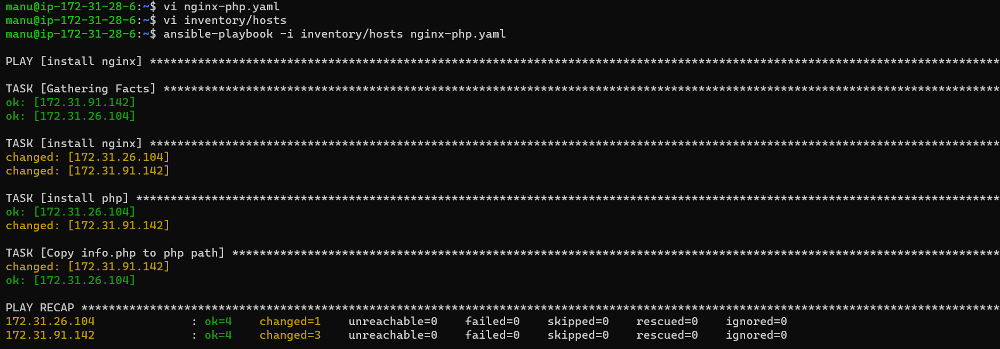
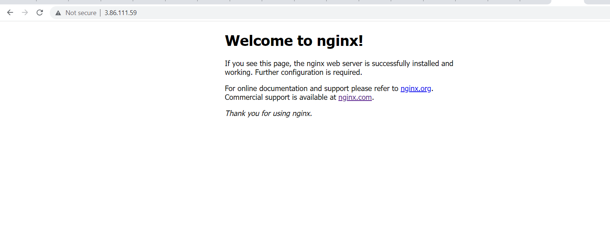
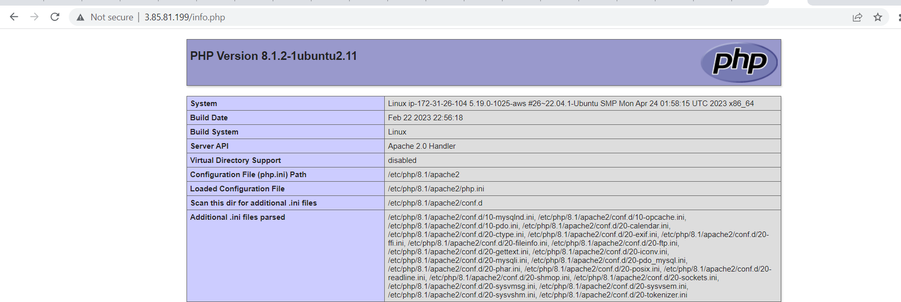
* Write a playbook to install java and dotnet
```yaml
# Installing java-17
---
- name: install openjdk-17-jdk
  hosts: all
  become: yes
  tasks:
    - name: install java-17
      ansible.builtin.apt:
        name: openjdk-17-jdk
        update_cache: yes
        state: present
# Installing dotnet-sdk-7
---
- name: install dotnet
  hosts: all
  become: yes
  tasks:
    - name: install url
      ansible.builtin.get_url:
        url: https://packages.microsoft.com/config/ubuntu/20.04/packages-microsoft-prod.deb
        dest: /tmp
    - name: Install a .deb package
      ansible.builtin.apt:
        deb: /tmp/packages-microsoft-prod.deb
    - name: installing dotnet
      ansible.builtin.apt:
        name: dotnet-sdk-7.0
        update_cache: yes
        state: present
```
* After completion of java installation and check the version
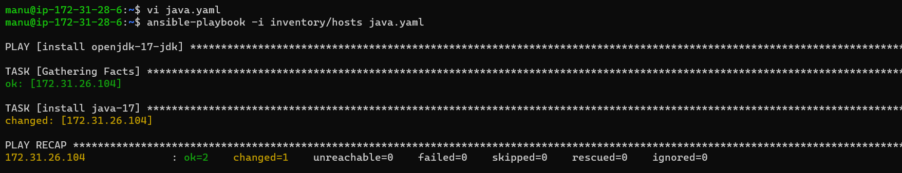

* After completion of dotnet installation and check the version
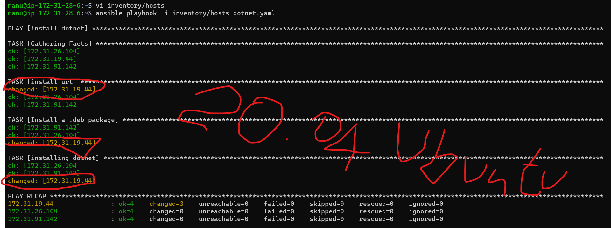
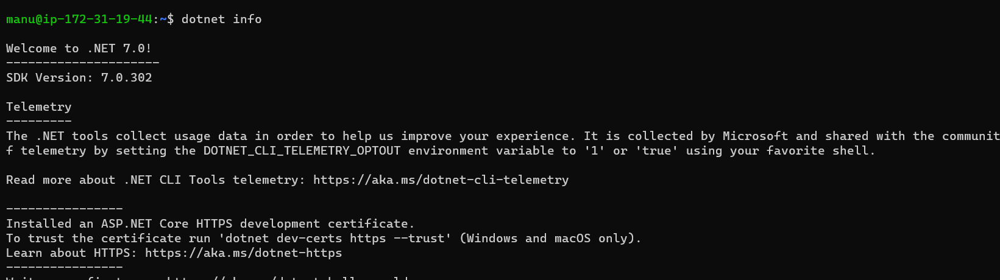
* Write a playbook to install metricbeat 
```yaml
## To install metricbeat in ansible 
---
- name: installing metricbeat
  hosts: all
  become: yes
  tasks:
    - name: metricbeat install
      apt_key:
        url: https://artifacts.elastic.co/GPG-KEY-elasticsearch
        state: present
    - name: installing trasport https
      ansible.builtin.apt:
        name: apt-transport-https
        update_cache: yes
        state: present
    - name: Save the repository definition to path
      ansible.builtin.shell:
        cmd: echo "deb https://artifacts.elastic.co/packages/8.x/apt stable main" | sudo tee -a /etc/apt/sources.list.d/elastic-8.x.list
    - name: Save the repository definition to path
      ansible.builtin.shell:
        cmd: echo "deb https://artifacts.elastic.co/packages/oss-8.x/apt stable main" | sudo tee -a /etc/apt/sources.list.d/elastic-8.x.list
    - name: installing metricbeat
      ansible.builtin.apt:
        name: metricbeat
        update_cache: yes
        state: present
    - name: enable metricbeat
      ansible.builtin.service:
        name: metricbeat
        enabled: true
        state: started
```
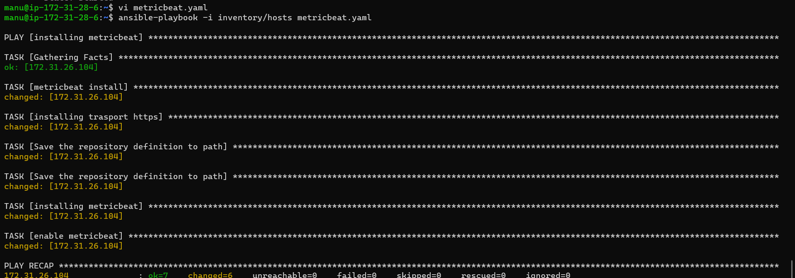
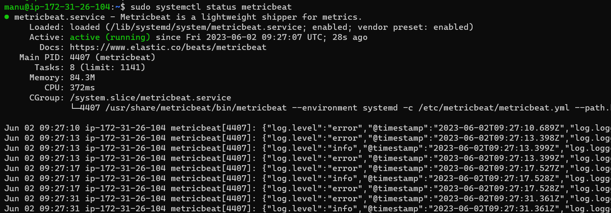
## Using facts 
* What is ansible facts (or) playbook variables and how to use these facts various types of facts such as Dictionary, List, Normal Text.
* Everything within the ansible_facts key in the returned dictionary is available as a variable in your playbooks and templates.
* Here is the list of facts would be returned when you run the ansible hostgroup -m setup command against any host group.
* This information can be obtained manually using Ansible ad-hoc command and a specialized module named setup.  In fact, ansible playbooks call this setup module by default to perform Gathering Facts task.
* The ansible **ad-hoc command** to invoke the ansible setup module is given below.
* `ansible <hostname (or) hostgroup> -m setup`
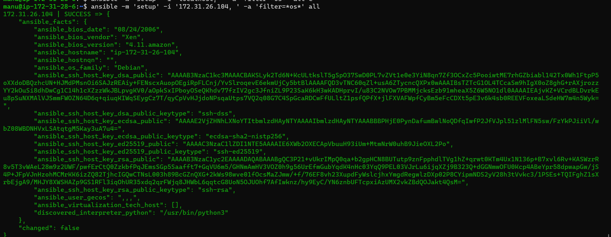
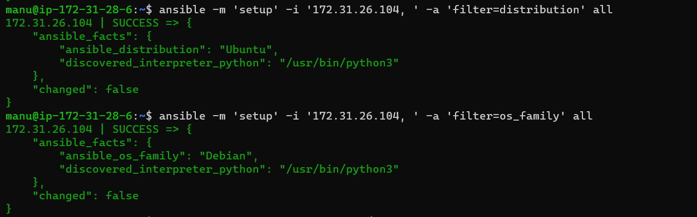
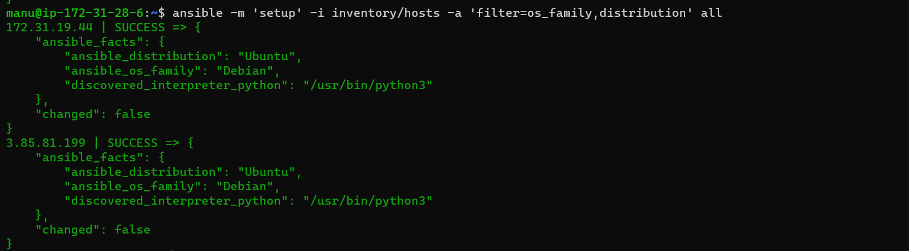

