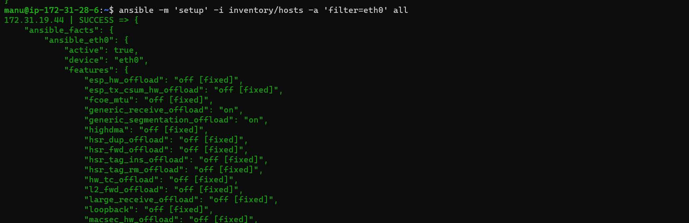
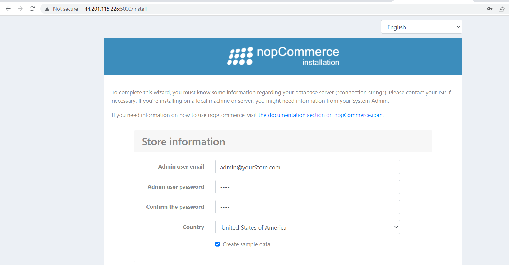
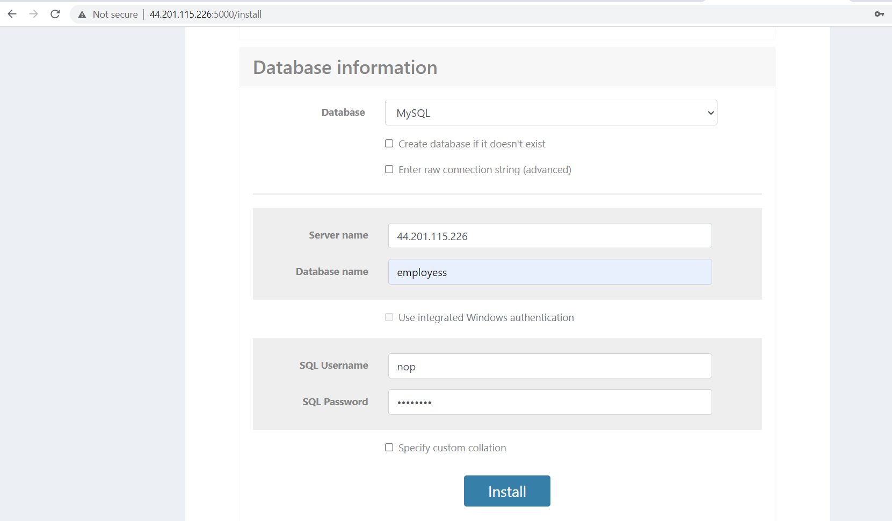

# Ansible-Practice
# Ansible: 
* It is an open-source automation tool, or platform, used for IT tasks such as configuration management, application deployment, intraservice orchestration, and provisioning.
* Ansible is a tool written in Python, and it uses the declarative markup language YAML to describe the desired state of devices and configuration. In association with the idea of a "desired state," Ansible also uses the concept of idempotency.
* function of Ansible roles allow you to develop reusable automation components by grouping and encapsulating related automation artifacts, like configuration files, templates, tasks, and handlers. 
# What is a node in Ansible?
* Ansible control nodes are primarily used to run tasks on managed hosts. You can use any machine with Python installed as an Ansible control node. However, you cannot use Windows as an Ansible control node. Managed nodes: Hosts that you manage using Ansible. 
* Inventory: A list of managed nodes.
# Configuration Management (CM)
* Ansible is a configuration management platform that automates storage, servers, and networking. When you use Ansible to configure these components, difficult manual tasks become repeatable and less vulnerable to error.
* There are two types of CM
* **Pull based CM:** In this type of configuration management tool, the nodes pull the configuration information from the server (hence, the name).A small software (called agent or client) is installed on every node.
* This agent/client will:at regular intervals, get the configuration from the server compare the configuration received from the server with the current configuration of the node, if there is any mis-match, take the steps required to match the configuration of the node with the configuration received from the server.
* Chef & Puppet are good examples of such configuration management tools.
* **Push Based CM:** In this type of configuration management tool, the main server (where the configuration data is stored) pushes the configuration to the node (hence, the name). So, it is the main server that initiates communication, not the nodes. Which means that an agent/client may or may not be installed on each node.
* Ansible & SaltStack are good examples of such configuration management tools.
# Architecture of Ansible
* Ansible works by connecting to your nodes and pushing out scripts called “Ansible modules” to them. Most modules accept parameters that describe the desired state of the system. Ansible then executes these modules (over SSH by default), and removes them when finished. Your library of modules can reside on any machine, and there are no servers, daemons, or databases required.
* Basic workflow

* Ansible control node can execute desired state on nodes using
    * adhoc commands
    * playbooks
* Playbooks are YAML files.
# How Operations Team work on multiple servers
* Organizations will have lot of servers and lot of admins
* Creating individual logins on each server for every admin is not a feasible solution.
* An effective way is organization creates a service account for the admins to login and perform administration.

# Installation of Ansible
* Create two virtual machines(EC2 instances) and login to machines by ssh into.
* One is control node and node.

* Then create a user in both machines and give sudo permissions for users by adding into sudoers file, switch as a user.
* Enable password based authontication no to yes in `/etc/ssh/sshd/sshd_config` and restart the service `sshd`

* Generate Public and Private keys by `ssh-keygen`
* connect to the machine using private key ssh -i <path-to-private key> username@ipaddress


* Install Ansible by using below commands
```
sudo apt update
sudo apt install software-properties-common -y
sudo add-apt-repository --yes --update ppa:ansible/ansible
sudo apt install ansible -y
```


* Verify ansible versions of ansible `ansible --version` and python `python3 --version`

* Lets add a Inventory, file called as hosts and add <ip address > of node.
* Check connectivity by executing `ansible -i hosts -m ping all`


## TASKS GIVEN IN CLASS
* Write a Playbook to install apache2 and nginx server with Php
```yaml
## To install apache server with php
---
- name: install apache2 server
  hosts: all
  become: yes
  tasks:
    - name: install apache2
      ansible.builtin.apt:
        name: apache2
        update_cache: yes
        state: present
    - name: install php
      ansible.builtin.apt:
        name: 
          - php
          - libapache2-mod-php
          - php-mysql
        update_cache: yes
        state: present
    - name: Copy info.php to php path
      ansible.builtin.copy:
        src: info.php
        dest: /var/www/html/info.php
```
* Create a playbook with above yaml file 
* Run the following commands to verfify & run playbook
`ansible-playbook -i invetory/hosts --syntax-check php.yaml`
`ansible-playbook -i invetory/hosts --check php.yaml`
`ansible-playbook -i invetory/hosts php.yaml`


```yaml
---
## To install nginx server with php
- name: install nginx
  hosts: all
  become: yes
  tasks:
    - name: install nginx
      ansible.builtin.apt:
        name: nginx
        update_cache: yes
        state: present
    - name: install php
      ansible.builtin.apt:
        name: 
          - php
          - libapache2-mod-php
          - php-mysql
        update_cache: yes
        state: present
    - name: Copy info.php to php path
      ansible.builtin.copy:
        src: info.php
        dest: /var/www/html/info.php
```
* Create a playbook with above yaml file 
* Run the following commands to verfify & run playbook
`ansible-playbook -i invetory/hosts --syntax-check nginx-php.yaml`
`ansible-playbook -i invetory/hosts --check nginx-php.yaml`
`ansible-playbook -i invetory/hosts nginx-php.yaml`


* Write a playbook to install java and dotnet
```yaml
# Installing java-17
---
- name: install openjdk-17-jdk
  hosts: all
  become: yes
  tasks:
    - name: install java-17
      ansible.builtin.apt:
        name: openjdk-17-jdk
        update_cache: yes
        state: present
# Installing dotnet-sdk-7
---
- name: install dotnet
  hosts: all
  become: yes
  tasks:
    - name: install url
      ansible.builtin.get_url:
        url: https://packages.microsoft.com/config/ubuntu/20.04/packages-microsoft-prod.deb
        dest: /tmp
    - name: Install a .deb package
      ansible.builtin.apt:
        deb: /tmp/packages-microsoft-prod.deb
    - name: installing dotnet
      ansible.builtin.apt:
        name: dotnet-sdk-7.0
        update_cache: yes
        state: present
```
* After completion of java installation and check the version


* After completion of dotnet installation and check the version


* Write a playbook to install metricbeat 
```yaml
## To install metricbeat in ansible 
---
- name: installing metricbeat
  hosts: all
  become: yes
  tasks:
    - name: metricbeat install
      apt_key:
        url: https://artifacts.elastic.co/GPG-KEY-elasticsearch
        state: present
    - name: installing trasport https
      ansible.builtin.apt:
        name: apt-transport-https
        update_cache: yes
        state: present
    - name: Save the repository definition to path
      ansible.builtin.shell:
        cmd: echo "deb https://artifacts.elastic.co/packages/8.x/apt stable main" | sudo tee -a /etc/apt/sources.list.d/elastic-8.x.list
    - name: Save the repository definition to path
      ansible.builtin.shell:
        cmd: echo "deb https://artifacts.elastic.co/packages/oss-8.x/apt stable main" | sudo tee -a /etc/apt/sources.list.d/elastic-8.x.list
    - name: installing metricbeat
      ansible.builtin.apt:
        name: metricbeat
        update_cache: yes
        state: present
    - name: enable metricbeat
      ansible.builtin.service:
        name: metricbeat
        enabled: true
        state: started
```


## Using facts 
* What is ansible facts (or) playbook variables and how to use these facts various types of facts such as Dictionary, List, Normal Text.
* Everything within the ansible_facts key in the returned dictionary is available as a variable in your playbooks and templates.
* Here is the list of facts would be returned when you run the ansible hostgroup -m setup command against any host group.
* This information can be obtained manually using Ansible ad-hoc command and a specialized module named setup.  In fact, ansible playbooks call this setup module by default to perform Gathering Facts task.
* The ansible **ad-hoc command** to invoke the ansible setup module is given below.
* `ansible <hostname (or) hostgroup> -m setup`




# Write a playbook to install NopCommerce, Openmrs and tomcat
# Nopcommerce playbook 
```yaml
## Write a playbook to install nopcommerce
---
- name: Installing nopcommerce
  hosts: all
  become: yes
  tasks:
    - name: install url
      ansible.builtin.get_url:
        url: https://packages.microsoft.com/config/ubuntu/20.04/packages-microsoft-prod.deb
        dest: /tmp
    - name: Install a .deb package
      ansible.builtin.apt:
        deb: /tmp/packages-microsoft-prod.deb
    - name: installing dotnet
      ansible.builtin.apt:
        name: dotnet-sdk-7.0
        update_cache: yes
        state: present
    - name: installing unzip
      ansible.builtin.apt:
        name: unzip
        update_cache: yes
        state: present
    - name: Add the user 'nopCommerce' with a primary group of 'nopCommerce'
      ansible.builtin.user:
        name: nopCommerce
    - name: Create a directory if it does not exist
      ansible.builtin.file:
        path: /var/www/nopCommerce
        state: directory
    - name: Download nopCommerce-zip file
      ansible.builtin.get_url:
        url: https://github.com/nopSolutions/nopCommerce/releases/download/release-4.60.3/nopCommerce_4.60.3_NoSource_linux_x64.zip
        dest: /var/www/nopCommerce
    - name: Unzip a file that is already on the remote machine
      ansible.builtin.unarchive:
        src: /var/www/nopCommerce/nopCommerce_4.60.3_NoSource_linux_x64.zip
        dest: /var/www/nopCommerce/
        remote_src: yes
    - name: Change file ownership, group and permissions
      ansible.builtin.file:
        path: /var/www/nopCommerce
        owner: nopCommerce
        group: nopCommerce
        mode: '0777'
        state: directory
        recurse: true
    - name: Create two directories bin and logs if it does not exist
      ansible.builtin.file:
        path: 
          - /var/www/nopCommerce/bin
          - /var/www/nopCommerce/logs
        state: directory
    - name: Copy nop service file to nopcommerce path
      ansible.builtin.copy:
        src: nopCommerce.service
        dest: /etc/systemd/system/nopCommerce.service
    - name: Start service nopCommerce, if not started
      ansible.builtin.service:
        name: nopCommerce
        enabled: true
        state: started
```
* To run playbook use the command: `ansible-playbook - i hosts nop.yaml`


# write a playbook to install Openmrs application
```yaml
## Write a playbook to install openmrs application without variables
--- 
- name: install openmrs application
  hosts: all
  become: yes
  tasks:
    - name: install java-17  ## install java 
      ansible.builtin.apt:
        name: openjdk-8-jdk
        update_cache: yes
        state: present
      notify:
        - daemon-reload
    - name: Create a group 
      ansible.builtin.group:
        name: tomcat
        state: present
    - name: Create a user 
      ansible.builtin.user:
        name: tomcat
        create_home: yes
        group: tomcat
        home: /opt/tomcat
        shell: /bin/false
    - name: Download tomcat tar file # install tomcat
      ansible.builtin.get_url:
        url: https://archive.apache.org/dist/tomcat/tomcat-7/v7.0.109/bin/apache-tomcat-7.0.109.tar.gz
        dest: "/tmp/apache-tomcat-7.0.109.tar.gz"
    - name: Create a directory if it does not exist
      ansible.builtin.file:
        path: /opt/tomcat
        state: directory
    - name: untar the the tomcat tar file
      ansible.builtin.unarchive:
        src: "/tmp/apache-tomcat-7.0.109.tar.gz"
        dest: /opt/tomcat
        remote_src: yes
        extra_opts:
          --strip-components=1
    - name: Flush handlers
      meta: flush_handlers
    - name: Changing group to tomcat
      ansible.builtin.file:
        path: /opt/tomcat
        group: tomcat
        owner: tomcat
        recurse: yes
        state: directory
    - name: Change conf permissions
      ansible.builtin.file:
        path: conf
        group: tomcat
        owner: tomcat
        recurse: yes
        mode: g+rx
    - name: Changing ownership for directories webapps permissions
      ansible.builtin.file:
        path:
          - webapps/
          - work/
          - temp/
          - logs
        group: tomcat
        owner: tomcat
        recurse: yes  
    - name: copy the tomcat service file
      ansible.builtin.template:
        src: tomcat.service
        dest: /etc/systemd/system/tomcat.service
  handlers:
    - name: daemon-reload
      ansible.builtin.systemd:
        daemon_reload: yes
      notify:
        - restart tomcat service
    - name: restart tomcat service
      ansible.builtin.systemd:
        name: tomcat
        state: started
      notify:
        - daemon-reload
    - name: create a directory if doesn't exists  # install openmrs app
      ansible.builtin.file:
        path: /var/lib/OpenMRS
        group: tomcat
        owner: tomcat
        recurse: yes
        state: directory
      notify:
        - daemon-reload
    - name: Download openmrs tar file
      ansible.builtin.get_url:
        url: https://sourceforge.net/projects/openmrs/files/releases/OpenMRS_Platform_2.5.0/openmrs.war
        dest: /tmp/openmrs.war
    - name: Flush handlers
      meta: flush_handlers
    - name: copy the war file
      ansible.builtin.copy:
        src: /tmp/openmrs.war
        dest: /opt/tomcat/webapps
        remote_src: yes
        group: tomcat
        owner: tomcat
      notify:
        - daemon-reload
    - name: Change ownership permissions for openmrs
      ansible.builtin.file:
        path: /opt/tomcat/webapps
        group: tomcat
        owner: tomcat
        recurse: yes
        state: directory
```
* TO run the playbook use the command: `ansible-playbook -i inventory/hosts Ansible_Practice/Playbooks/Tasks/Openmrs/openmrs_no-variable.yaml`


* Openmrs playbook using variables
```yaml
## Write a playbook to install openmrs application 
--- 
- name: install openmrs application
  hosts: tomcat
  become: yes
  tasks:
    - name: check if the playbook is being executed on supported os
      ansible.builtin.fail:
        msg: "this playbook is designed to run only on ubuntu"
      when: ansible_facts['distribution'] != "Ubuntu"
    - name: install java-17  ## install java 
      ansible.builtin.apt:
        name: "{{ java_version }}"
        update_cache: yes
        state: present
      notify:
        - daemon-reload
    - name: Create a group 
      ansible.builtin.group:
        name: "{{ group }}"
        state: present
    - name: Create a user 
      ansible.builtin.user:
        name: "{{ user }}"
        create_home: yes
        group: "{{ group }}"
        home: "{{ home_dir }}"
        shell: "{{ into_shell }}"
    - name: Download tomcat tar file # install tomcat
      ansible.builtin.get_url:
        url: https://archive.apache.org/dist/tomcat/tomcat-{{ tomcat_main_ver }}/v{{ tomcat_ver }}/bin/apache-tomcat-{{ tomcat_ver }}.tar.gz
        dest: "/tmp/apache-tomcat-{{ tomcat_ver }}.tar.gz"
    - name: flush_handlers
      meta: flush_handlers
    - name: Create a directory if it does not exist
      ansible.builtin.file:
        path: "{{ home_dir }}"
        state: directory
    - name: untar the the tomcat tar file
      ansible.builtin.unarchive:
        src: "/tmp/apache-tomcat-{{ tomcat_ver }}.tar.gz"
        dest: "{{ home_dir }}"
        remote_src: yes
        extra_opts:
          --strip-components=1
    - name: Changing group to tomcat
      ansible.builtin.file:
        path: "{{ home_dir }}"
        group: "{{ group }}"
        owner: "{{ user }}"
        recurse: yes
        state: directory
    - name: Change conf permissions
      ansible.builtin.file:
        path: conf
        group: "{{ group }}"
        owner: "{{ user }}"
        recurse: yes
        mode: g+rx
    - name: Changing ownership for directories webapps permissions
      ansible.builtin.file:
        path:
          - webapps/
          - work/
          - temp/
          - logs
        group: "{{ group }}"
        owner: "{{ user }}"
        recurse: yes  
      notify:
        - daemon-reload
    - name: copy the tomcat service file
      ansible.builtin.template:
        src: tomcat.service.j2
        dest: /etc/systemd/system/tomcat.service
  handlers:
    - name: daemon-reload
      ansible.builtin.systemd:
        daemon_reload: yes
    - name: start tomcat service
      ansible.builtin.systemd:
        name: tomcat
        state: started
    - name: create a directory if doesn't exists  # install openmrs app
      ansible.builtin.file:
        path: /var/lib/OpenMRS
        group: "{{ group }}"
        owner: "{{ user }}"
        recurse: yes
        state: directory
    - name: Download openmrs tar file
      ansible.builtin.get_url:
        url: https://sourceforge.net/projects/openmrs/files/releases/OpenMRS_Platform_2.5.0/openmrs.war
        dest: /tmp/openmrs.war
    - name: flush_handlers
      meta: flush_handlers
    - name: copy the war file
      ansible.builtin.copy:
        src: /tmp/openmrs.war
        dest: "{{ home_dir }}/webapps"
        remote_src: yes
        group: "{{ group }}"
        owner: "{{ user }}"
      notify:
        - daemon-reload
    - name: Change file, use and group permissions
      ansible.builtin.file:
        path: "{{ home_dir }}/webapps"
        group: "{{ group }}"
        owner: "{{ user }}"
        recurse: yes
        state: directory
```
* To run the playbook use the command: `ansible-playbook -i variables_openmrs/hosts variables_openmrs/openmrs.yaml`


# Write a playbook to install tomcat10 using variables
```yaml
## Write a playbook to install tomcat10
--- 
- name: install tomcat10 server
  hosts: tomcat
  become: yes
  tasks:
    - name: check if the playbook is being executed on supported os
      ansible.builtin.fail:
        msg: "this playbook is designed to run only on ubuntu"
      when: ansible_facts['distribution'] != "Ubuntu"
    - name: install java-11  ## install java 
      ansible.builtin.apt:
        name: "{{ java_version }}"
        update_cache: yes
        state: present
    - name: Create a group 
      ansible.builtin.group:
        name: "{{ group }}"
        state: present
    - name: Create a user 
      ansible.builtin.user:
        name: "{{ user }}"
        create_home: yes
        group: "{{ group }}"
        home: "{{ home_dir }}"
        shell: "{{ shell }}"
    - name: Download tomcat tar file # install tomcat
      ansible.builtin.get_url:
        url: "https://www-eu.apache.org/dist/tomcat/tomcat-{{ tomcat_main_ver }}/v{{ tomcat_ver }}/bin/apache-tomcat-{{ tomcat_ver }}.tar.gz"
        dest: "/tmp/apache-tomcat-{{ tomcat_ver }}.tar.gz"
    - name: flush_handlers
      meta: flush_handlers
    - name: find if the tomcat is already extracted
      ansible.builtin.stat:
        path: "{{ home_dir }}/apache-tomcat-{{ tomcat_ver }}/LICENSE"
      register: license_info
    - name: untar the the tomcat tar file
      ansible.builtin.unarchive:
        src: "/tmp/apache-tomcat-{{ tomcat_ver }}.tar.gz"
        dest: "{{ home_dir }}"
        remote_src: yes
      when: not  license_info.stat.exists
      notify:
        - Add execute permissions for shell scripts
    - name: create a symbolic link
      ansible.builtin.file:
        src: "{{ home_dir }}/apache-tomcat-{{ tomcat_ver }}"
        dest: "{{ home_dir }}/latest"
        state: link
      notify:
        - Add execute permissions for shell scripts
    - name: Changing group to tomcat
      ansible.builtin.file:
        path: "{{ home_dir }}"
        group: "{{ group }}"
        owner: "{{ user }}"
        recurse: yes
        state: directory
    - name: copy the tomcat service file
      ansible.builtin.template:
        src: tomcat.service.j2
        dest: /etc/systemd/system/tomcat.service
      notify:
        - start tomcat service 
    - name: Configuring Tomcat users
      ansible.builtin.template:
        src: tomcat-users.xml.j2
        dest: "{{ home_dir }}/latest/conf/tomcat-users.xml"
        owner: "{{ user }}"
        group: "{{ group }}"
      notify:
        - start tomcat service
    - name: access to all for manager app
      ansible.builtin.template:
        src: context.xml.j2
        dest: "{{ home_dir }}/latest/webapps/manager/META-INF/context.xml"
        owner: "{{ user }}"
        group: "{{ group }}"
      notify:
        - start tomcat service
    - name: access to all for host manager app
      ansible.builtin.template:
        src: context.xml.j2
        dest: "{{ home_dir }}/latest/webapps/host-manager/META-INF/context.xml"
        owner: "{{ user }}"
        group: "{{ group }}"
      notify:
        - start tomcat service
  handlers:
    - name: Add execute permissions for shell scripts
      ansible.builtin.shell:
        cmd: "chmod +x {{ home_dir }}/latest/bin/*.sh"   
    - name: daemon-reload
      ansible.builtin.systemd:
        daemon_reload: yes
    - name: start tomcat service
      ansible.builtin.systemd:
        name: tomcat
        enabled: yes
        state: restarted
```
* To run the playbook use the command: `ansible-playbook -i Ansible_practice/Playbook/Tasks/tomcat/hosts Ansible_practice/Playbook/Tasks/tomcat/tomcat10.yaml `


* To access the manager and hostmanager app in tomcat we have to configure the tomcat users, after configuration


# Ansible_Roles
# NopCommerce role
* To create a Role use the command `ansible-galaxy role init <name_of_role>` the role get creates.
* After role creation by using `sftp` to download the role into your local system by using `get -r <name_of_role>`
* write a playbook to call nopcommerce with mysql role
* Before using mysql role install mysql role into your machine by using `ansible-galaxy install geerlingguy.mysql`
* Grant the privileges to mysql
```yaml
---
- name: install nopcommerce using role
  hosts: nop
  become: yes
  roles:
    - nopcommerce
    - geerlingguy.mysql
  vars:
    mysql_bind_address: 0.0.0.0
    mysql_root_password: nop123
```
* `ansible-playbook -i inventory/hosts Ansible_practice/ansible_role/nop.yaml`






# Mysql_role
* Install mysql role by using `ansible-galaxy install geerlingguy.mysql`
* write a playbook to call mysql role 
```yaml
---
- name: install mysql using role
  hosts: mysql
  become: yes
  roles:
    - geerlingguy.mysql
  vars:
    mysql_bind_address: 0.0.0.0
    mysql_root_password: nop123
```
* To run playbook use the command: `ansible-playbook -i inventory/hosts Ansible_practice/ansible_role/mysql_role.yaml`


* After installation mysql login to the mysql by using `mysql -u root -p` and enter password then it will connect to the mysql server

# Tomcat10_role
* write a playbook to call tomcat_role
```yaml
---
- name: install tomcat10 using role
  hosts: tomcat
  become: yes
  roles:
    - tomcat10
```
* To run playbook use the command:`ansible-playbook -i Ansible_practice/Playbook/Tasks/tomcat/hosts Ansible_practice/ansible_role/tomcat_role.yaml`


